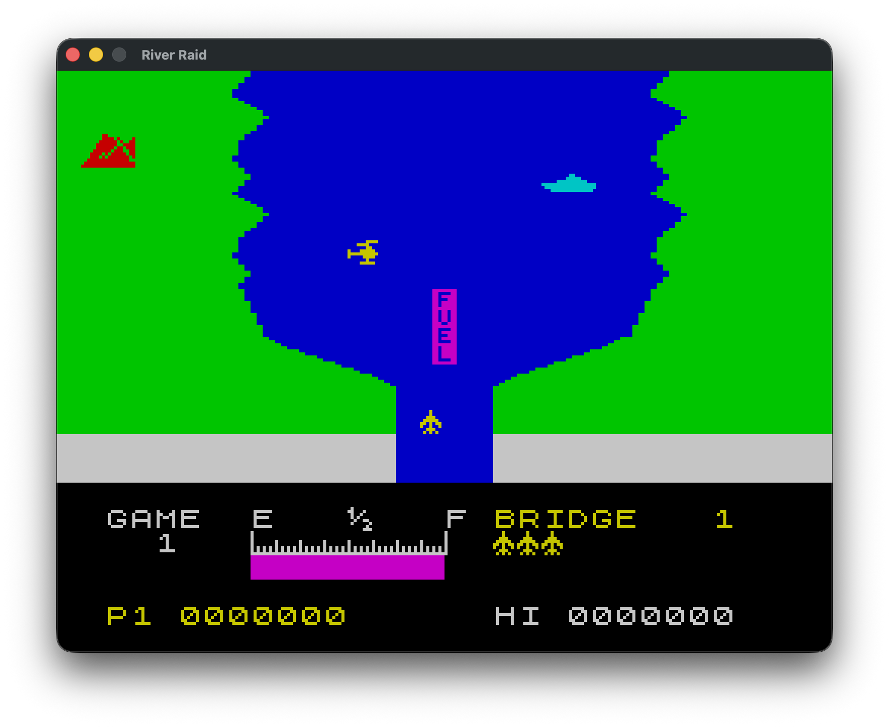

# River Raid (Ebiten)

A remake of the ZX Spectrum 48K game **River Raid** (1984, Activision) in Go using
the [Ebiten](https://ebitengine.org/) game engine. The game logic was reverse-engineered from the original via
an [annotated disassembly](https://river-raid.github.io/river-raid-disasm/)
([source](https://github.com/river-raid/river-raid-disasm)).

## Play Online

A WebAssembly build is available at [river-raid.github.io](https://river-raid.github.io/).

## Future: Modernized Remake

The faithful reimplementation is a foundation for a potential modernized remake. The mechanics would be preserved
exactly as reverse-engineered, with the presentation brought up to date:

- **Resolution** — render at native target resolution rather than scaling up the 256×192 ZX Spectrum screen
- **Frame rate** — smooth gameplay to 60 FPS; the original's 12 FPS is a result of suboptimal implementation, not a
  design choice
- **Sprites** — replace the monochrome pixel bitmaps with full-color, higher-resolution artwork
- **Audio** — replace the 1-bit beeper with sampled sound effects and music
- **Touch controls** — make the game playable on mobile devices
